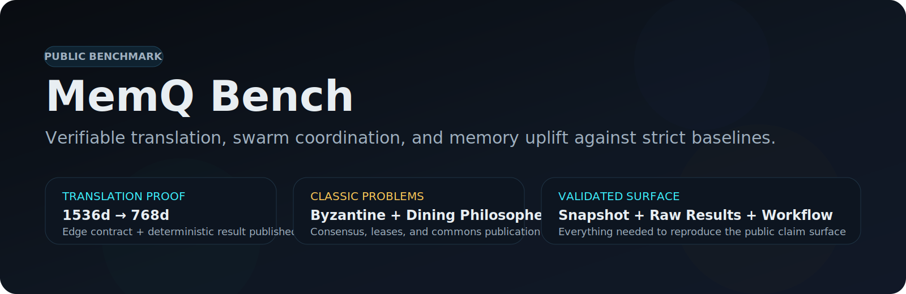

<p align="center">
  
</p>

<p align="center">
  <a href="https://github.com/multinex-ai/memq-bench/actions/workflows/benchmark.yml"></a>
  <a href="./artifacts/snapshot.json"></a>
  <a href="./artifacts/snapshot.json"></a>
  <a href="./artifacts/snapshot.json"></a>
  <a href="./docs/reproducibility-protocol.md"></a>
  <a href="./docs/publication.md"></a>
</p>

<p align="center">
  Public MemQ benchmark repo for proving token savings, translation-aware coordination, and multi-agent memory retention against stateless and naive-memory controls.
</p>

## Official Docs

- [MemQ Bench Docs](./docs/README.md)
- [Quickstart](./docs/tutorials/quickstart.md)
- [Translation Accelerated Fabric Tutorial](./docs/tutorials/translation-accelerated-fabric.md)
- [Coordination Benchmarks Tutorial](./docs/tutorials/coordination-benchmarks.md)
- [Methodology](./docs/methodology.md)

## Why this repo exists

MemQ Bench is the public proof surface for MemQ’s memory and translation claims.

It answers three concrete questions:

1. Can MemQ preserve coordination facts that stateless and naive-memory agents drop?
2. Can MemQ translate vectors across model spaces without paying a re-embedding tax?
3. Can MemQ turn resolved coordination patterns into reusable memory that improves future agent runs?

The benchmark compares four conditions:

- `stateless`
- `naive_memory`
- `memq_core`
- `memq_accelerated`

## Current validated snapshot

The checked-in snapshot is a deterministic fixture smoke run over five tasks:

- `embedding-translation-fabric`
- `byzantine-generals-consensus`
- `dining-philosophers-leases`
- `manual-copy-regression`
- `protocol-tool-discipline`

The current public proof is meant to validate the harness and the memory contract.
It is strict evidence for the benchmark repo itself, and a safe public surface for
explaining the architecture before larger external tracks are published.

| Condition | Result | Avg duration | Avg packed tokens |
| --- | --- | --- | --- |
| `memq_core` | `5 / 5 passed` | `17 ms` | `171` |
| `memq_accelerated` | `5 / 5 passed` | `115 ms` | `171` |
| `naive_memory` | `0 / 5 passed` | `1 ms` | `61` |
| `stateless` | `0 / 5 passed` | `2 ms` | `34` |

That yields a `+100` pass-point delta from the best MemQ condition over the
best baseline in the current deterministic smoke run.

Quick proof links:

- [Snapshot JSON](./artifacts/snapshot.json)
- [Badge data JSON](./artifacts/badges.json)
- [Summary markdown](./artifacts/summary.md)
- [Translation payload and result](./artifacts/translation-showcase.md)
- [Raw result files](./artifacts/results/)

## Benchmark cases

| Case | What it demonstrates |
| --- | --- |
| `embedding-translation-fabric` | Exact recall of the public translation contract, payload, and result. |
| `byzantine-generals-consensus` | Multi-agent consensus after translated command vectors are normalized into one decision space. |
| `dining-philosophers-leases` | Resource coordination, deadlock avoidance, and `_commons` publication of resolved issues. |
| `manual-copy-regression` | Regression avoidance from prior build failures. |
| `protocol-tool-discipline` | Correct MemQ usage loop and search/recent split. |

## Translation spotlight

The benchmark repo ships a canonical example of the MemQ translation contract:

```json
{
  "vector": [0.91, 0.42, -0.18, 0.07],
  "source_dimension": 4,
  "target_dimension": 2,
  "source_profile": {
    "provider": "openai",
    "model": "text-embedding-3-large",
    "dimension": 4
  },
  "target_profile": {
    "provider": "cloudflare",
    "model": "bge-base-en-v1.5",
    "dimension": 2
  }
}
```

```json
{
  "mode": "stateless_translation",
  "translated_vector": [0.91, 0.42],
  "dimension": 2,
  "method": "truncation",
  "quality": {
    "retention": 0.5,
    "lossless": false
  }
}
```

This same translation proof is referenced inside the Byzantine Generals benchmark
to show that cross-model command vectors can be normalized before quorum.

## Quickstart

```bash
cd memq-bench
npm install
npm run bench
```

That sequence runs:

- type-check
- result cleanup
- deterministic smoke benchmark
- snapshot publication

## Public claims discipline

- `fixture` runs validate the harness and deterministic memory logic.
- `local_cli` and `antigravity` should be published separately once those tracks are pinned.
- Translation savings claims should always link back to the translation artifact and the snapshot.
- `_commons` coordination claims should cite the benchmark tasks that exercise `resolved_issue` and consensus promotion behavior.
- README badges must resolve to GitHub workflow state, committed snapshot artifacts, or first-party docs in this repo.
