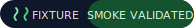

<p align="center">
  
</p>

<p align="center">
  <a href="./docs/publication.md"></a>
  <a href="./docs/reproducibility-protocol.md"></a>
  <a href="./artifacts/summary.md"></a>
  <a href="./docs/publication.md"></a>
  <a href="./docs/publication.md"></a>
</p>

<p align="center">
  Public benchmark harness for measuring how much structured MemQ memory changes agent outcomes against stateless and naive-memory controls, with deterministic fixtures, pinned artifacts, and a benchmark-only accelerated retrieval ceiling.
</p>

## Navigation

- [Why this repo exists](#why-this-repo-exists)
- [Current validated snapshot](#current-validated-snapshot)
- [What this benchmarks](#what-this-benchmarks)
- [Reproduce the run](#reproduce-the-run)
- [Artifact and doc map](#artifact-and-doc-map)
- [Public claims discipline](#public-claims-discipline)

## Why This Repo Exists

MemQ Bench exists so the memory stack can be evaluated in public without hand-waving.

It compares four conditions:

- `stateless`
- `naive_memory`
- `memq_core`
- `memq_accelerated`

The repo is built around one rule: every benchmark claim must trace back to a generated snapshot, the exact run manifest that produced it, and the raw result files underneath.

## Current Validated Snapshot

The currently checked-in public proof is a **deterministic fixture smoke run**. It is valid engineering evidence for the harness and retrieval stack. It is **not** the final public pricing claim surface until external `local_cli` and `antigravity` runs are published.

<table>
  <tr>
    <td><strong>MemQ Core</strong><br /><code>3 / 3 passed</code></td>
    <td><strong>Stateless Baseline</strong><br /><code>0 / 3 passed</code></td>
    <td><strong>Delta</strong><br /><code>+100 pts</code></td>
    <td><strong>Avg Core Duration</strong><br /><code>29 ms</code></td>
  </tr>
</table>

Quick proof links:

- [Current snapshot JSON](./artifacts/snapshot.json)
- [Human-readable summary](./artifacts/summary.md)
- [Raw smoke result files](./artifacts/results/)
- [Smoke run manifest](./configs/smoke.json)

## What This Benchmarks

### Execution Tracks

- `fixture` — deterministic smoke and CI validation track
- `local_cli` — external local agent adapter track
- `antigravity` — external Antigravity adapter track

### Conditions

| Condition | Purpose |
| --- | --- |
| `stateless` | No memory system is available. |
| `naive_memory` | Transcript-style recall only. No structured retrieval or memory tooling. |
| `memq_core` | Current shipped MemQ MCP loop: `memory_status`, `search_memory`, `recent_memory`, `get_memory`, `add_memory`, `reflect_memory`. |
| `memq_accelerated` | Benchmark-only retrieval ceiling with context slicing, Soul Journal packing, optional Graphiti augmentation, optional Qdrant retrieval, and optional LangChain reranking. |

### Task Families in the Current Corpus

- cross-session release recall
- manual regression avoidance
- protocol and tool-discipline retention

Task specs live under [`./tasks/`](./tasks/), fixtures under [`./fixtures/`](./fixtures/), and harness code under [`./src/`](./src/).

## Reproduce the Run

### 1. Install and smoke-test

```bash
cd benchmarks/memq-bench
npm install
npm run type-check
npm run smoke
npm run publish
```

### 2. Boot the pinned MemQ stack

```bash
docker compose up -d
```

### 3. Run external adapters

```bash
export MEMQ_BENCH_LOCAL_CLI_CMD='path/to/local-agent-wrapper'
export MEMQ_BENCH_ANTIGRAVITY_CMD='path/to/antigravity-wrapper'
```

Each adapter receives these environment variables:

- `MEMQ_BENCH_TASK_FILE`
- `MEMQ_BENCH_TASK_ID`
- `MEMQ_BENCH_WORKSPACE`
- `MEMQ_BENCH_CONTEXT_FILE`
- `MEMQ_BENCH_OUTPUT_FILE`
- `MEMQ_BENCH_TRACK`
- `MEMQ_BENCH_CONDITION`

The adapter must write a JSON result file to `MEMQ_BENCH_OUTPUT_FILE` with at least:

```json
{
  "answer": "...",
  "artifacts": ["optional trace entries"],
  "toolCalls": ["optional tool trace"]
}
```

## Artifact and Doc Map

### Operator references

- [Docs index](./docs/README.md)
- [Methodology](./docs/methodology.md)
- [Reproducibility protocol](./docs/reproducibility-protocol.md)
- [Artifact map](./docs/artifact-map.md)
- [Publication rules](./docs/publication.md)

### Benchmark outputs

- [Snapshot JSON](./artifacts/snapshot.json)
- [Summary markdown](./artifacts/summary.md)
- [Run-level results](./artifacts/results/)

### Run manifests

- [Debug manifest](./configs/debug.json)
- [Smoke manifest](./configs/smoke.json)
- [Nightly manifest](./configs/nightly.json)

### Portfolio context

- [Multinex benchmarks index](../README.md)

## Public Claims Discipline

- `fixture` runs validate the harness; they do not justify final commercial uplift claims on their own.
- Public claims should move to `local_cli` and `antigravity` once those tracks are published with the same discipline.
- If two tracks run on incompatible model configurations, publish them separately instead of blending them into one headline.
- Placeholder standards badges in this repo are presentation marks only until their external program references exist.
- The source of truth is always the checked-in snapshot plus the raw result files that generated it.
