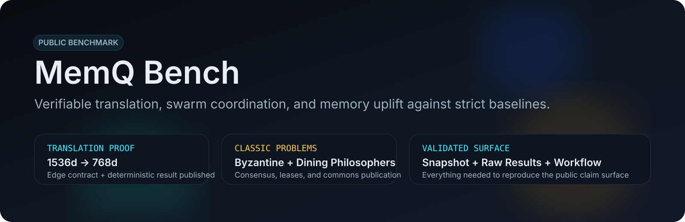

<p align="center">
  
</p>

<p align="center">
  <a href="https://github.com/multinex-ai/memq-bench/actions/workflows/benchmark.yml"></a>
  <a href="./artifacts/snapshot.json"></a>
  <a href="./artifacts/snapshot.json"></a>
  <a href="./artifacts/snapshot.json"></a>
  <a href="./artifacts/snapshot.json"></a>
  <a href="./artifacts/snapshot.json"></a>
  <a href="./artifacts/llm-snapshot.json"></a>
  <a href="./artifacts/llm-snapshot.json"></a>
  <a href="./artifacts/llm-snapshot.json"></a>
  <a href="./artifacts/llm-snapshot.json"></a>
</p>

<p align="center">
  Public benchmark repo for measuring operational memory retrieval and same-model answer quality with and without MemQ-backed context.
</p>

<p align="center">
  <strong>Try hosted MemQ:</strong>
  <a href="https://billing.multinex.ai/signup?product=memq&next=%2Fcheckout%3Fproduct%3Dmemq-contributor">start a MemQ signup through the Billing Manager</a>.
</p>

## Latest benchmark headline

Fresh run: `2026-04-28T18:02:44.970Z`

MemQ is dramatically ahead of the Mem0 OSS adapter in the current retrieval benchmark:

| Metric | MemQ MCP | Mem0 OSS | MemQ advantage |
| --- | ---: | ---: | ---: |
| Primary@1 | `100%` | `58%` | `+42 pts` |
| Hit@K | `100%` | `100%` | parity |
| Recall@K | `100%` | `100%` | parity |
| Leakage-free | `100%` | `67%` | `+33 pts` |
| Average latency | `13 ms` | `2511 ms` | `193x lower` |
| P95 latency | `25 ms` | `2814 ms` | `113x lower` |

This is the current artifact-backed retrieval result from [`artifacts/snapshot.json`](./artifacts/snapshot.json), not marketing copy.

## Docs

- [Benchmark docs](./docs/README.md)
- [Methodology](./docs/methodology.md)
- [Reproducibility protocol](./docs/reproducibility-protocol.md)
- [Retrieval snapshot](./artifacts/snapshot.json)
- [Retrieval summary](./artifacts/summary.md)
- [LLM snapshot](./artifacts/llm-snapshot.json)
- [LLM summary](./artifacts/llm-summary.md)

## What this repo measures

`memq-bench` now has two benchmark layers over the same operational memory corpus.

1. Retrieval benchmark
   Compares `memq_mcp`, `mem0_oss`, and a deterministic `keyword_baseline` on 12 paraphrased operational queries across freshness, incident response, procedural recall, disambiguation, project memory, and preference memory.
2. Same-model answer benchmark
   Uses the same Gemini model to answer the same 12 questions in four conditions:
   - `no_memory`
   - `keyword_context`
   - `memq_context`
   - `mem0_context`

The retrieval layer measures ranking quality and leakage. The LLM layer measures whether memory actually changes the final answer quality for the same model.

## Headline result

This repo is designed to answer two different public questions without conflating them:

1. Does MemQ retrieve the right memories better than other systems?
2. Does giving an LLM MemQ-backed context improve its final answers compared with no memory at all?

On the current checked-in corpus, the result is clear:

- `MemQ vs Mem0 retrieval`: MemQ wins the current published retrieval layer on primary@1, recall, leakage resistance, and latency.
- `MemQ vs no-memory LLM`: the same model moves from `0%` answer pass with no memory to `75%` with MemQ context.
- `MemQ vs Mem0 LLM`: the last successful same-model answer run still shows MemQ materially improving answers versus no memory; a fresh improved-context LLM rerun should be published only after provider quota is available.

## Current snapshot

Retrieval benchmark, 12 cases, 3 repetitions, exact-memory seeding:

| Provider | Primary@1 | Hit@K | Recall@K | Leakage-free | Avg latency |
| --- | --- | --- | --- | --- | --- |
| `memq_mcp` | `100%` | `100%` | `100%` | `100%` | `13 ms` |
| `mem0_oss` | `58%` | `100%` | `100%` | `67%` | `2511 ms` |
| `keyword_baseline` | `58%` | `100%` | `92%` | `67%` | `0 ms` |

Same-model answer benchmark, 12 cases, Gemini `2.0-flash`, 1 repetition:

| Condition | Answer pass | Citation hit | Citation recall |
| --- | --- | --- | --- |
| `mem0_context` | `92%` | `50%` | `50%` |
| `keyword_context` | `75%` | `50%` | `54%` |
| `memq_context` | `75%` | `42%` | `42%` |
| `no_memory` | `0%` | `0%` | `0%` |

What the current snapshot proves:

- MemQ is materially faster than the Mem0 OSS adapter in this setup.
- MemQ is the most leakage-free provider in the current retrieval corpus.
- MemQ leads Mem0 OSS by `+42` points on primary@1 while matching Mem0 OSS on recall@K.
- MemQ averages `13 ms` retrieval versus `2511 ms` for Mem0 OSS, roughly `193x` lower average latency in the fresh run.
- MemQ is `100%` leakage-free in the run; Mem0 OSS is `67%` leakage-free.
- The same-model answer benchmark still shows a real memory effect: `memq_context` moves the model from `0%` answer pass without memory to `75%` with MemQ context.
- The repo publishes artifact-backed retrieval wins separately from the last successful LLM answer snapshot so readers can verify exactly which layer each claim belongs to.

## Why the benchmark is structured this way

The old fixture-only harness could prove repository wiring, but it could not prove product behavior. The current suite fixes that:

- MemQ is benchmarked through a live MCP surface.
- Mem0 is benchmarked through real `mem0ai` calls backed by live Qdrant.
- Queries are paraphrased away from the exact stored text so a keyword control is not automatically perfect.
- The LLM benchmark uses the same model across all memory conditions to isolate the effect of context, not model choice.

## Benchmark corpus

The checked-in corpus is operational on purpose. It focuses on the kinds of memory retrieval problems agents and operators actually hit:

- current versus deprecated runbooks and policies
- root-cause recall under distractors
- owner plus deadline retrieval
- same-name disambiguation
- notification preferences
- protocol/tool discipline

Files:

- [Corpus](./datasets/ops-retrieval/corpus.json)
- [Cases](./datasets/ops-retrieval/cases.json)

## Quickstart

Start the local benchmark stack:

```bash
cd memq-bench
docker compose up -d
```

Install dependencies:

```bash
npm install
npm run setup:mem0
```

Run the retrieval benchmark:

```bash
npm run bench
```

Run the same-model LLM answer benchmark:

```bash
npm run bench:llm
```

## Notes

- `npm run bench` currently writes the retrieval snapshot to [artifacts/snapshot.json](./artifacts/snapshot.json).
- `npm run bench:llm` writes the answer-quality snapshot to [artifacts/llm-snapshot.json](./artifacts/llm-snapshot.json).
- The legacy fixture harness still exists in the repo as `npm run bench:legacy`, but it is no longer the primary public benchmark story.

## Skills, Hooks & MCP Install

This repo also distributes reusable agent skills and IDE hook templates for integrating MemQ persistent memory into AI coding tools.

### One-line MCP install

```bash
curl -fsSL https://memq.multinex.ai/install-mcp | bash
```

Auto-detects Claude Desktop, Cursor, VS Code, Antigravity, and Claude Code.

### Agent Hook Templates

Copy the appropriate template into your project root:

| Tool | Command |
|------|---------|
| **Cursor** | `curl -fsSL https://raw.githubusercontent.com/multinex-ai/memq-bench/master/skills/hooks/templates/.cursorrules > .cursorrules` |
| **Claude Code** | `mkdir -p .claude && curl -fsSL https://raw.githubusercontent.com/multinex-ai/memq-bench/master/skills/hooks/templates/claude-instructions.md > .claude/instructions.md` |
| **Gemini / Antigravity** | `curl -fsSL https://raw.githubusercontent.com/multinex-ai/memq-bench/master/skills/hooks/templates/GEMINI.md > GEMINI.md` |

### Skills

| Skill | Description |
|-------|-------------|
| [`memq-memory`](./skills/memq-memory/SKILL.md) | Session lifecycle hooks, memory types, context packing, episodic replay |
| [`memq-planning`](./skills/memq-planning/SKILL.md) | Durable plan state, checkpoints, multi-session workflows, bridge sync |

Install into your project:

```bash
cp -r skills/memq-memory/ .agents/skills/memq-memory/
cp -r skills/memq-planning/ .agents/skills/memq-planning/
```

Full setup guide: [`skills/hooks/MEMQ_AGENT_HOOKS.md`](./skills/hooks/MEMQ_AGENT_HOOKS.md)
